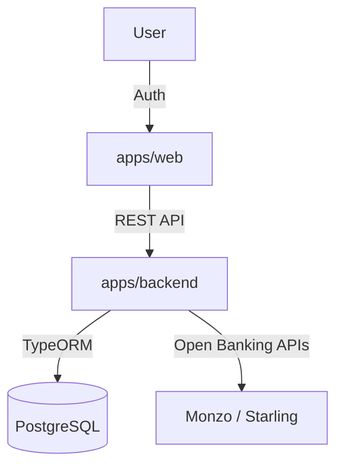

# Flump App Functionality Overview

Flump is a personal finance dashboard and decision-making platform designed specifically for UK users. This document outlines the core functional modules, their integration points, and details the business logic rules to facilitate ongoing development and enhancement.

---

## 1. Core Modules

### 1.1 Net Worth Dashboard
- **Aggregate Balance Tracking**: Pulls latest balances from all accounts to calculate total assets, total liabilities, and net worth.
- **Trend Visualization**: Renders an interactive historical line chart illustrating net worth progression over 6 months, 12 months, or all-time.
- **Asset Allocation**: A visual breakdown (pie chart) displaying how capital is distributed among account types (Current, Savings, Investments, Owed).

### 1.2 Multi-Account Management
- **Manual Accounts**: Users can manually register and update accounts across several types:
  - Current, Savings, Credit Card, Investment, Loan, Mortgage.
- **Automated Bank Sync**: Integration with UK Open Banking providers (Monzo, Starling) to automatically sync account balances and pull in transactions.
- **Transaction Logs**: Interactive display of recent transactions filtered by category (Food, Salary, Utilities, Interest, etc.).

### 1.3 Savings Forecast & Tax Tools
- **Take-home Pay Estimator**: Estimates regular PAYE take-home salary based on standard tax bands, personal allowance, and pension contributions.
- **Compound Interest Calculator**: Forecasts savings growth over multiple years given starting balances, monthly contributions, and an interest rate.

### 1.4 Mortgage Optimizations
- **Amortization Tracking**: Tracks mortgage remaining terms, interest rates, and remaining principal balances.
- **Overpayment Simulator**: Simulates regular or one-off overpayments to calculate total interest saved and the duration by which the term is shortened.
- **Compare Savings vs. Overpayment**: Interactive calculator comparing the return of overpaying a mortgage against saving in an ISA/Savings Account (adjusting for marginal tax brackets).

### 1.5 Self-Employed & Rental Tax Tracker (New)
- **Detailed Log**: Record cash-basis income and expenses for self-employed businesses or rental property properties.
- **Receipt Capture**: Upload digital receipts (PDF/images) or capture camera images (mobile/web) converted to base64 strings and stored locally.
- **P&L Summary Table**: Auto-calculated profit and loss across fiscal years (6 April to 5 April) matching standard UK Self-Assessment reporting structure.
- **UK Self-Assessment Estimator**: Calculates marginal income tax and National Insurance liabilities:
  - Tapered personal allowance above £100,000.
  - Class 4 National Insurance contributions (6% / 2% bands).
  - **Section 24 Rules**: Non-deductible mortgage interest for rental property, replaced with a 20% basic rate tax credit capped at lower of interest, profit, or taxable income.
  - Ownership share calculations to divide rental revenue/costs for joint owners.

---

## 2. Technical Architecture & Data Models

### 2.1 Monorepo Layout
- `apps/web`: React Router client app styled with Panda CSS.
- `apps/backend`: NestJS REST API using TypeORM connecting to a PostgreSQL database.
- `apps/mobile-companion`: React Native mobile application for on-the-go tracking.
- `packages/ui`: Shared design system elements and style tokens.
- `packages/common`: Shareable types, validators, and utility functions.

### 2.2 Shared Entities & Database Schema
- **Account / AccountDetail**: Represents financial accounts and monthly value snapshots.
- **Transaction**: Bank transaction feeds.
- **BudgetEntry**: Standard monthly/annual cash-flow planner entries.
- **TaxRecord**: Business/property ledger entries.
- **UserProfile**: User setup values (salary, employment types, ownership share).

---

## 3. Integration Points

### 3.1 Financial Seeding
When a user accesses the Tax Tracker page for the first time, the backend automatically seeds a complete history matching the user's Poplar CSV detailed records. This provides immediate value and illustrates the summary computations and tax-year comparison tables out of the box.
